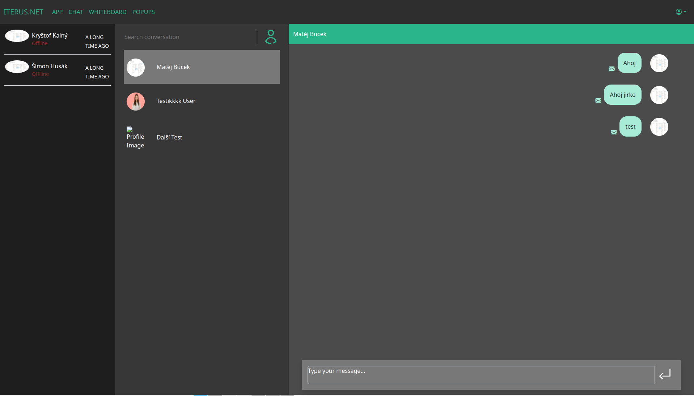

# Chat
- In the left column you can see contacts and their status (online, offline) and when they were last seen.
- In the middle column there are chats that you have already started and you can open them from there. On the top of the column you can search the conversations.
- On the right is the chat itself. On the bottom you can type a new message and send it either by pressing enter or by pressing the button on the right.
- It is worth mentioning that message bubbles on the right are the ones you have sent and the ones on the left are received messages.

